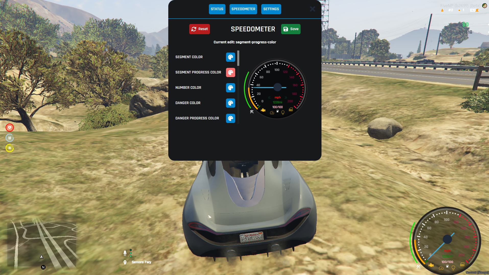

<h1 align='center'>[ESX] HUD</a></h1><p align='center'><b><a href='https://discord.esx-framework.org/'>Discord</a> - <a href='https://documentation.esx-framework.org/legacy/installation'>Documentation</a></b></h5>

We've brought you a clean, modern HUD that's easy to customise and configure. Integrated mileage calculation and more.

Features
 - Mileage calculation system
 - Indicator system with sound effect
 - Weapon HUD with ammo counter
 - Online player counter
 - Job label
 - Switch to mph or kmh
 - Color picker that allows you to customize the interface
 - Settings panel for additional settings
 - Different speedo layouts depending on vehicle type(LAND,AIR)
 - Seatbelt system with sound effect (Required script: esx_cruisecontrol)

## HUD UI

## SETTINGS UI


## Developed by Gellipapa#9186 && Rav3n95#2849
## Special thanks: Csoki, csontvazharcos, Füsti

## Download & Installation

- [Download Link](https://github.com/esx-framework/esx_hud/releases/latest/download/esx_hud.zip)
- Put it in the `[addons]` directory
- Open web folder in console and run these command `npm install` after `npm run build`
- After that, the HUD will work correctly
- Enjoy

## Installation
- Add this to your `server.cfg`:

```
ensure esx_hud
```

# Legal
### License
esx_hud - hud script for ESX

Copyright (C) 2023 ESX-Framework

This program Is free software: you can redistribute it And/Or modify it under the terms Of the GNU General Public License As published by the Free Software Foundation, either version 3 Of the License, Or (at your option) any later version.

This program Is distributed In the hope that it will be useful, but WITHOUT ANY WARRANTY; without even the implied warranty Of MERCHANTABILITY Or FITNESS FOR A PARTICULAR PURPOSE. See the GNU General Public License For more details.

You should have received a copy Of the GNU General Public License along with this program. If Not, see http://www.gnu.org/licenses/.
